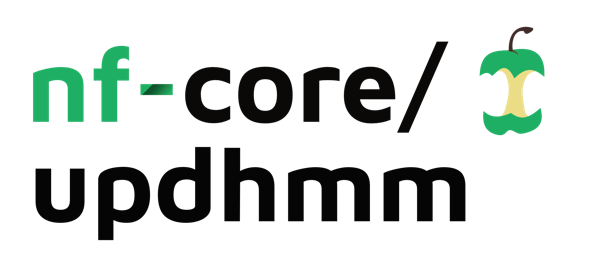

<h1>
  <picture>
    <source media="(prefers-color-scheme: dark)" srcset="docs/images/nf-core-updhmm_logo_dark.png">
    
  </picture>
</h1>

[](https://github.com/nf-core/updhmm/actions/workflows/ci.yml)
[](https://github.com/nf-core/updhmm/actions/workflows/linting.yml)[](https://nf-co.re/updhmm/results)[](https://doi.org/10.5281/zenodo.XXXXXXX)
[](https://www.nf-test.com)

[](https://www.nextflow.io/)
[](https://github.com/nf-core/tools/releases/tag/3.3.1)
[](https://docs.conda.io/en/latest/)
[](https://www.docker.com/)
[](https://sylabs.io/docs/)
[](https://cloud.seqera.io/launch?pipeline=https://github.com/nf-core/updhmm)

[](https://nfcore.slack.com/channels/updhmm)[](https://bsky.app/profile/nf-co.re)[](https://mstdn.science/@nf_core)[](https://www.youtube.com/c/nf-core)

---
## Introduction

**CIBERER/GdTBioinfo-nf-UPDhmm** is a best-practice analysis pipeline for the **detection of uniparental disomy (UPD)** in trio sequencing data, using [UPDhmm](https://github.com/saraamenasantamaria/UPDhmm-project) and additional preprocessing steps tailored to clinical datasets.

The pipeline is built using [Nextflow](https://www.nextflow.io) DSL2, enabling portability across HPC and cloud infrastructures. Each process runs within its own container, ensuring reproducibility and simplifying software management. Containers from [Biocontainers](https://biocontainers.pro/) are used whenever possible.  

Where appropriate, modules are reused or patched from [nf-core/modules](https://github.com/nf-core/modules); custom modules are implemented locally following nf-core guidelines.

---

## Pipeline summary

This pipeline standardizes the detection of uniparental disomy (UPD) events in trio sequencing data. The workflow consists of two main phases:

### 1. Preprocessing

Prepares trio data by combining individual VCFs/GVCFs and applying filters to retain only high-quality biallelic SNVs.

**Annotation removal and filtering:**

- **`REMOVE_ANNOTATIONS`** – Indexes VCF/GVCF files, filters for autosomes (chr1-22), removes unused annotations, and regroups files by family. Optionally extracts variants with ambiguous variant allele frequency (VAF) for downstream masking (`--apply_vaf_filter`).

**Trio combination:**

- **`COMBINE_VCF`** – Merges VCFs from proband, mother, and father into a joint file. Retains either all variants (union mode, default) or only shared variants (intersection mode, `--perform_intersection true`).
- **`COMBINE_GVCF`** – For gVCF input (`--is_gvcf true`), performs GVCF combination and joint genotyping using GATK to generate a single combined VCF per family trio.

**Variant masking:**

- **`SV_MASK_BED`** – Removes variants overlapping structural variants and regions with ambiguous VAF if mask files are provided.

**Quality filtering:**

- **`FILTER_LOWCONF`** – Applies hard filters to generate the final preprocessed VCF per family:
  - Genotype correction (optional):
    - **`SETGT`** – Sets missing genotypes to homozygous reference (0/0) when `--perform_intersection false`
    - **`SETGT_VAF`** – Corrects genotypes based on VAF thresholds when `--apply_vaf_correction true`
  - Variant filtering:
    - Retain only biallelic SNVs
    - Apply minimum genotype quality (GQ ≥ `--GQ_min`) and depth (DP ≥ `--DP_min`) thresholds
    - Exclude variants where all trio members are homozygous reference (0/0 or 0|0)
    - Exclude problematic genomic regions (centromeres, segmental duplications, HLA/KIR loci)

### 2. UPD Detection

Runs the UPDhmm core functions to identify genomic blocks consistent with uniparental disomy patterns.

- **`VCF_CHECK`** – Trio VCF preprocessing with quality-aware genotype encoding
- **`CALCULATE_EVENTS`** – Hidden Markov Model (HMM)-based UPD event detection across autosomes
- **`COLLAPSE_EVENTS`** – Event collapsing to merge adjacent/overlapping UPD regions per family

> Each step is implemented as a separate DSL2 module. Outputs are organized by step and method.

---

## Usage

### Input samplesheet

Prepare a **CSV file** with your input data.  
Each row represents a family (trio), with identifiers for father, mother, and proband, and paths to the corresponding VCFs.  
Structural variant VCFs can also be included (set to `-` if not available).

```csv title="samplesheet.csv"
fam_id,proband_id,mother_id,father_id,path_vcf_proband,path_vcf_mother,path_vcf_father,path_sv_proband,path_sv_mother,path_sv_father
FAM001,PROBAND_01,MOTHER_01,FATHER_01,/data/vcfs/proband_01.vcf.gz,/data/vcfs/mother_01.vcf.gz,/data/vcfs/father_01.vcf.gz,-,-,-
FAM002,PROBAND_02,MOTHER_02,FATHER_02,/data/vcfs/proband_02.vcf.gz,/data/vcfs/mother_02.vcf.gz,/data/vcfs/father_02.vcf.gz,/data/svs/proband_02_sv.bed,/data/svs/mother_02_sv.bed,/data/svs/father_02_sv.bed
```

**Samplesheet format:**

| Column             | Description                                                                                          |
| ------------------ | ---------------------------------------------------------------------------------------------------- |
| `fam_id`           | Family identifier. This will be used to name output files.                                           |
| `proband_id`       | Sample ID for the proband.                                                                           |
| `mother_id`        | Sample ID for the mother.                                                                            |
| `father_id`        | Sample ID for the father                                              .                              |
| `path_vcf_proband` | Full path to proband VCF/gVCF file (must be bgzipped).                                  |
| `path_vcf_mother`  | Full path to mother VCF/gVCF file (must be bgzipped).                                   |
| `path_vcf_father`  | Full path to father VCF/gVCF file (must be bgzipped).                                   |
| `path_sv_proband`  | Full path to structural variant BED/VCF file for proband (use `-` if not available).                 |
| `path_sv_mother`   | Full path to structural variant BED/VCF file for mother (use `-` if not available).                  |
| `path_sv_father`   | Full path to structural variant BED/VCF file for father (use `-` if not available).                  |


Then, you can run the pipeline using:

<!-- TODO nf-core: update the following command to include all required parameters for a minimal example -->

```bash
nextflow run nf-core/updhmm \
   -profile <docker/singularity/.../institute,test> \
   --input samplesheet.csv \
   --outdir <OUTDIR> \
   --genome_build <hg38/hg19> \
```

For more details and further functionality, please refer to the [usage](usage.md) documentation.

## Output summary

For each trio, the pipeline generates two main types of output:  

1. **Preprocessed VCF (`<fam_id>_filtered_final.vcf.gz`)**  
   High-quality, filtered VCF produced by the preprocessing phase. This file contains only **biallelic SNVs** that passed all quality control filters and serves as input for UPD detection analyses. The VCF is compressed (.vcf.gz) and accompanied by a tabix index (.tbi). It includes three samples in order: proband, mother, and father, with minimal FORMAT annotations retained (GT, AD, DP, GQ).  

2. **Raw events (`<fam_id>.upd_events.txt`)**  
   Direct output of the `UPDhmm::calculateEvents` function. This file contains all detected UPD candidate events without additional filtering.  

The core UPDhmm function, `calculateEvents`, returns a **data.frame** containing all detected UPD events for a given trio.  
If no events are found, an empty data.frame is returned.  

**Output columns:**  

| Column              | Description                                                      |
| ------------------- | ---------------------------------------------------------------- |
| `ID`                | Identifier of the proband (child sample)                         |
| `chromosome`        | Chromosome identifier                                            |
| `start`             | Start genomic position of the UPD block                          |
| `end`               | End genomic position of the UPD block                            |
| `group`             | Predicted UPD type (`iso_mat`, `iso_fat`, `het_mat`, `het_fat`)  |
| `n_snps`            | Number of informative SNVs within the event                      |
| `ratio_proband`     | Ratio of average read depth inside the event vs. the genome-wide average (including the event) for the proband. A value close to 1 indicates balanced coverage; deviations may suggest copy-number changes. |
| `ratio_mother`      | Ratio of average read depth inside the event vs. genome-wide average (including the event) for the mother |
| `ratio_father`      | Ratio of average read depth inside the event vs. genome-wide average (including the event) for the father |
| `n_mendelian_error` | Number of Mendelian inheritance errors supporting the event      |

   **Example output:**

   | ID  | chromosome | start | end | group    | n_snps | n_mendelian_error | ratio_proband | ratio_mother | ratio_father |
   |-----|------------|-------|-----|---------|--------|-----------------|---------------|--------------|--------------|
   | S1  | 1          | 50    | 70  | iso_mat | 5      | 1               | 0.98          | 1.00         | 0.95         |
   | S1  | 1          | 75    | 85  | iso_mat | 3      | 5               | 1.01          | 1.03         | 0.97         |
   | S1  | 1          | 100   | 120 | iso_mat | 8      | 5               | 0.99          | 1.01         | 0.96         |
   | S1  | 1          | 150   | 180 | iso_mat | 10     | 10              | 1.02          | 1.04         | 0.98         |
   | S1  | 1          | 300   | 320 | het_pat | 6      | 3               | 0.97          | 0.98         | 0.99         |
   | S2  | 2          | 500   | 520 | iso_mat | 12     | 50              | 1.03          | 1.05         | 1.00         |
   | S2  | 2          | 550   | 580 | iso_mat | 7      | 30              | 1.01          | 1.02         | 0.99         |


3. **Collapsed events (`<fam_id>.udp_collapsed.txt`)**  
   Postprocessed and filtered results. Overlapping events of the same type within the same chromosome are merged into a single representative block.  
   
**Output columns:**  

| Column                 | Description                                                                 |
|------------------------|-----------------------------------------------------------------------------|
| `ID`                   | Identifier of the proband (child sample)                                    |
| `chromosome`           | Chromosome identifier                                                        |
| `start`                | Start genomic position of the UPD block                                      |
| `end`                  | End genomic position of the UPD block                                        |
| `group`                | Predicted UPD type (`iso_mat`, `iso_fat`, `het_mat`, `het_fat`)             |
| `n_events`             | Number of raw events that were collapsed into this entry                     |
| `total_mendelian_error`| Sum of Mendelian errors from all collapsed events                             |
| `total_size`           | Total genomic span covered by the collapsed events                           |
| `total_snps`           | Total number of SNPs in the overlapping events                               |
| `prop_covered`         | Proportion of the region covered by the merged events                        |
| `collapsed_events`     | Comma-separated list of the original event coordinates that were merged      |
| `ratio_proband`        | Weighted mean ratio of read depth for the proband across the collapsed events |
| `ratio_mother`         | Weighted mean ratio of read depth for the mother across the collapsed events  |
| `ratio_father`         | Weighted mean ratio of read depth for the father across the collapsed events  |

**Example output:**

   | ID  | chromosome | start | end | group    | n_events | total_mendelian_error | total_size | total_snps | prop_covered | ratio_proband | ratio_mother | ratio_father | collapsed_events            |
   |-----|------------|-------|-----|---------|----------|---------------------|------------|------------|--------------|---------------|--------------|--------------|----------------------------|
   | S1  | 1          | 300   | 320 | het_pat | 1        | 3                   | 20         | 6          | 1.00         | 0.97          | 0.98         | 0.99         | 1:300-320                  |
   | S1  | 1          | 100   | 180 | iso_mat | 2        | 15                  | 50         | 18         | 0.625        | 1.01          | 1.03         | 0.97         | 1:100-120,1:150-180        |
   | S2  | 2          | 500   | 580 | iso_mat | 2        | 80                  | 50         | 19         | 0.625        | 1.02          | 1.04         | 1.00         | 2:500-520,2:550-580        |
 
These are generated from the **raw events** using the `collapseEvents(subset_df = df, min_ME = 2, min_size = 200)` function.

For more details, please refer to the [output](output.md) documentation.

## Test execution

You can test the pipeline using the small example dataset provided in this repository.  
The test dataset contains two trios (subset of a single chromosome):  
- One trio includes a **simulated UPD event**  
- The other trio is a **negative control** without UPD  

The dataset is available at [Zenodo (10.5281/zenodo.17193905)](https://zenodo.org/records/17193905).  

Run the pipeline in **test mode** with:  

```bash
nextflow run nf-core/updhmm \
   -profile <docker/singularity>,test \
   --outdir <OUTDIR> \
   --genome_build <hg38/hg19>
```

## Credits

nf-core/updhmm was originally written by Sara Mena Santamaría, Marta Sevilla Porras and Carlos Ruiz Arenas.


## Contributions and Support

If you would like to contribute to this pipeline, please see the [contributing guidelines](.github/CONTRIBUTING.md).


## Citations (pending)

<!-- TODO nf-core: Add citation for pipeline after first release. Uncomment lines below and update Zenodo doi and badge at the top of this file. -->
<!-- If you use nf-core/updhmm for your analysis, please cite it using the following doi: [10.5281/zenodo.XXXXXX](https://doi.org/10.5281/zenodo.XXXXXX) -->

<!-- TODO nf-core: Add bibliography of tools and data used in your pipeline -->

An extensive list of references for the tools used by the pipeline can be found in the [`CITATIONS.md`](CITATIONS.md) file.

You can cite the `nf-core` publication as follows:

> **The nf-core framework for community-curated bioinformatics pipelines.**
>
> Philip Ewels, Alexander Peltzer, Sven Fillinger, Harshil Patel, Johannes Alneberg, Andreas Wilm, Maxime Ulysse Garcia, Paolo Di Tommaso & Sven Nahnsen.
>
> _Nat Biotechnol._ 2020 Feb 13. doi: [10.1038/s41587-020-0439-x](https://dx.doi.org/10.1038/s41587-020-0439-x).
